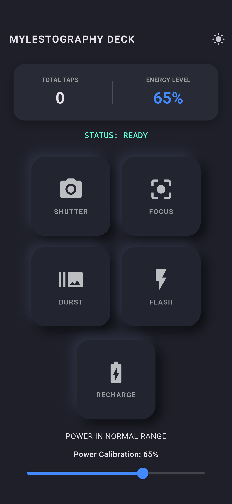
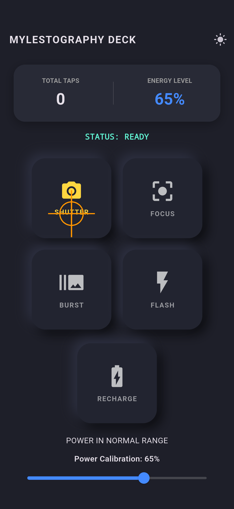

# 📷 Mylestography Control Studio (Flutter)

A photography-inspired 3D neomorphic control deck built with Flutter and Dart. It demonstrates touch feedback and local state through simulated camera controls; it does not operate a physical camera.

## ✨ Features
- **Photography Controls**: Shutter, Focus, Burst, and Flash each have a distinct icon, accent color, and status message. Dual opposing BoxShadows and GestureDetector make them depress on touch.
- **Live State Management**: A tap counter, power slider, and status monitor update through setState.
- **Power Feedback**: The background changes to a warm warning color above 80% power and returns to normal at 80% or below.
- **Adaptive Theme System**: Switch between light and dark modes from the app bar.
- **Modular Component Design**: Every control reuses TactileButton and keeps its pressed state local.
- **Fifth Control**: Hold Recharge to restore power to 100%; a short tap displays a hold instruction.

## 🛠️ Tech Stack
- **Framework**: Flutter (Material 3)
- **Language**: Dart
- **Key Widgets**: StatefulWidget, GestureDetector, AnimatedContainer, Slider, Wrap

## Design Decisions
I chose a photography console to connect the activity to Mylestography. Shutter uses an amber camera icon, Focus uses teal focus brackets, Burst uses a purple burst icon, and Flash uses a blue lightning bolt. Each control has a readable label so color is not the only cue. The controls simulate actions through the dashboard rather than claiming to operate a real camera. Above 80%, the warm background and HIGH POWER message make the threshold visible in both themes. Recharge uses a long press to separate it from an ordinary command; restoring 100% intentionally activates the high-power warning. Local pressed state keeps touching one control from depressing the other controls.

## Run and Verify
```
flutter pub get
flutter run
flutter analyze
flutter test
```
The tests cover local and shared pressed state, gesture cancellation, the 80/81 threshold, and long-press recharge. Temporary variants in test/experiments reproduce the required shared-state and reversed-shadow experiments without changing the final app. Exact test output is in submission/test-evidence.txt.

## Assignment Source
Adapted from the instructor's heavily commented starter code:
https://codd.cs.gsu.edu/~lhenry23/Web/inc/inc03/v2/index.html

## Screenshots
The two submission screenshots were captured from the app running on the Pixel 7 Pro Android emulator. The second captures Shutter while held down, before the command is released.




The emulator screenshot test passed. `flutter analyze` reported no issues, and all three widget tests passed.

## GitHub Repository
https://github.com/ozemoya/inclass_act03
